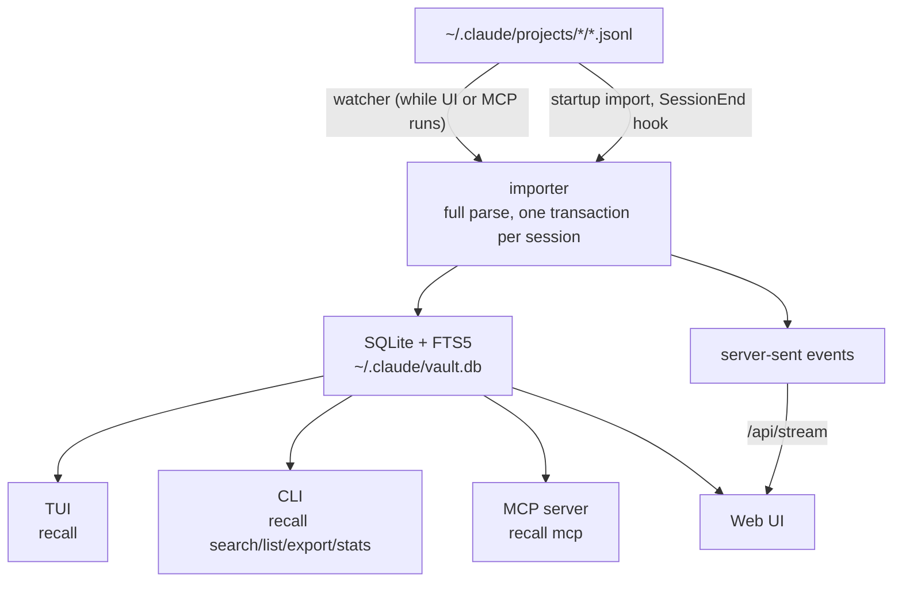

# Architecture

`recall` is one binary. The CLI starts each way into the archive: the TUI (`recall`), the MCP server (`recall mcp`, started by Claude Code) and the web UI (`recall ui`), and it also searches, lists and exports on its own.

The web UI and the MCP server import everything on startup and run the watcher while they are up. The `SessionEnd` hook imports when a session ends. The TUI and the CLI read the archive as it is.



## Sync timing

| State | What happens |
|---|---|
| UI or MCP running | Changed transcripts are imported after they stop changing for 300 ms, from `~/.claude/projects` and every tree in `extra_projects_dirs` |
| A session ends | The plugin's `SessionEnd` hook runs `recall import` |
| UI or MCP starts | A full import catches up on everything written in the meantime, in the background |

A tree in `extra_projects_dirs` that is not there yet, such as a container's before its first run, is looked for again on every poll and imported from once it appears. Inside a container, the plugin's `SessionEnd` hook imports into the container's own `~/.claude/vault.db`, not the host's: the host's watcher and catch-up import are what archive a container's sessions. Do not bind-mount the host's `vault.db` into a container.

The watcher polls file sizes and mtimes every 250 ms; see [ADR-002](adr/002-fs-watch-for-realtime-updates.md). Every Claude Code session runs its own `recall mcp`, so several importers often run at once: writers take the write lock at BEGIN and wait for it, and a session that fails to import does not stop the others.

## Database

```sql
sessions (session_id, project, project_path, git_branch, first_prompt,
          summary, message_count, started_at, ended_at, claude_version,
          file_mtime, file_size, imported_at, title)

messages (id, session_id, uuid, role, block_type, block_index, content,
          tool_name, tool_input, timestamp, turn_index)
          -- UNIQUE(session_id, uuid, block_index): a natural key, so a
          -- re-import of the whole file is idempotent

images (id, session_id, message_uuid, image_index, media_type, data)

messages_fts (content)  -- FTS5, porter unicode61 tokenizer
```

Each import mirrors the session's current JSONL: its rows are replaced in one transaction (see [ADR-003](adr/003-mirror-jsonl-not-independent-archive.md)). Sessions whose JSONL was deleted stay in the archive, which makes `vault.db` the only copy of them. Schema changes are additive migrations tracked by `PRAGMA user_version`.

### What is stored

| Stored (as `block_type`) | Excluded |
|--------|----------|
| `text` (user and assistant) | system events (turn_duration and others) |
| `thinking` | file-history-snapshot |
| `tool_use` and `tool_result` | sidechains (`isSidechain`) |
| `meta` (slash-command expansions, task notifications) | progress, queue-operation, last-prompt, pr-link |

## Web UI live updates

While the UI runs, it receives `session_updated` events over server-sent events. No Claude Code hook is needed.

- No search or filter: every event is applied. A known session moves to the top with its new message count; a new session is prepended if it now ranks first.
- Project filter: events for sessions outside the project are ignored.
- Committed search: the result set is frozen until the search box is cleared. Typing without committing does not freeze it.
- Chat view: an event for the open session refetches it. If you were at the bottom, the view follows the tail; otherwise your scroll position stays.
